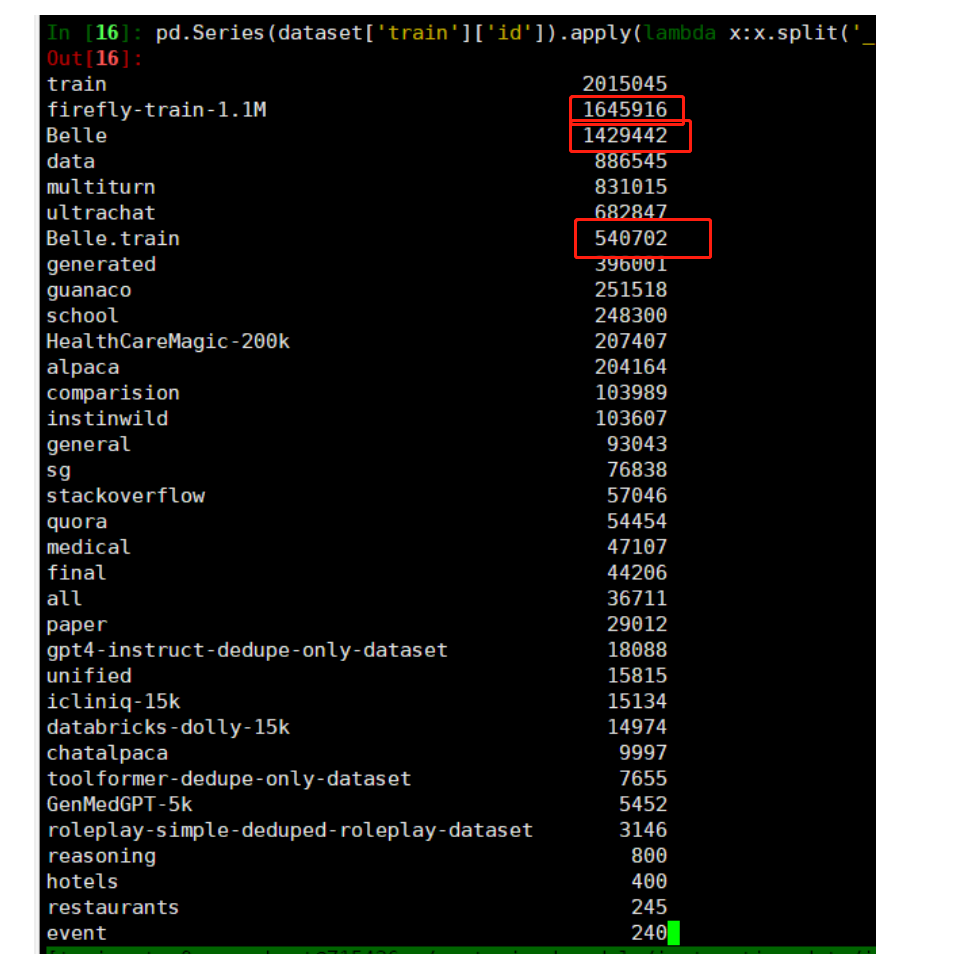

## 模型训练记录QA

### 1 在gogpt底座微调（sft）阶段，出现学习率为0
学习率慢慢变为0，一开始还是正常的学习预热+衰减，但是到后期（比如迭代2000步）之后，学习率直接变为0了。
```text
gradient_accumulation_steps设置为1

在Github Issues看到也和deepspeed的学习率规划器设置冲突了，去除deepspeed中关于优化器和学习率规划器的设置即可
```


### 2 在gogpt底座微调（sft）阶段，出现loss为0

（1）和数据集有关系,和数据集这个需要检查是否存在泄露，loss为0也是正常的
（2）和累计梯度大小有关系，设置为1；和精度有关系，不用float16
### 3 指令微调的时候模板应该怎么设计？不用模板可以吗？

常见的是stanford_alpaca中模板：
```text
PROMPT_DICT = {
    "prompt_input": (
        "Below is an instruction that describes a task, paired with an input that provides further context. "
        "Write a response that appropriately completes the request.\n\n"
        "### Instruction:\n{instruction}\n\n### Input:\n{input}\n\n### Response:"
    ),
    "prompt_no_input": (
        "Below is an instruction that describes a task. "
        "Write a response that appropriately completes the request.\n\n"
        "### Instruction:\n{instruction}\n\n### Response:"
    ),
}
```


Llama2中的模板
```text
instruction = """[INST] <<SYS>>\nYou are a helpful, respectful and honest assistant. Always answer as helpfully as possible, while being safe.  Your answers should not include any harmful, unethical, racist, sexist, toxic, dangerous, or illegal content. Please ensure that your responses are socially unbiased and positive in nature.

            If a question does not make any sense, or is not factually coherent, explain why instead of answering something not correct. If you don't know the answer to a question, please don't share false information.\n<</SYS>>\n\n{} [/INST]"""

```

Linly-AI中模板
```text
### Instruction:{prompt.strip()}  ### Response:
```

NousResearch

```text
### Instruction:
<prompt>

### Response:
<leave a newline blank for model to respond>
```

```text
### Instruction:
<prompt>

### Input:
<additional context>

### Response:
<leave a newline blank for model to respond>

```

Yayi
> https://huggingface.co/wenge-research/yayi-7b-llama2
> 
```text
prompt = "你是谁？"
formatted_prompt = f"""<|System|>:
You are a helpful, respectful and honest assistant named YaYi developed by Beijing Wenge Technology Co.,Ltd. Always answer as helpfully as possible, while being safe. Your answers should not include any harmful, unethical, racist, sexist, toxic, dangerous, or illegal content. Please ensure that your responses are socially unbiased and positive in nature.\n\nIf a question does not make any sense, or is not factually coherent, explain why instead of answering something not correct. If you don't know the answer to a question, please don't share false information.

<|Human|>:
{prompt}

<|YaYi|>:
"""
```

StableBeluga2
> https://huggingface.co/stabilityai/StableBeluga2
```text
### System:
This is a system prompt, please behave and help the user.

### User:
Your prompt here

### Assistant:
The output of Stable Beluga 2
```
比如
```text
system_prompt = "### System:\nYou are Stable Beluga, an AI that follows instructions extremely well. Help as much as you can. Remember, be safe, and don't do anything illegal.\n\n"

message = "Write me a poem please"
prompt = f"{system_prompt}### User: {message}\n\n### Assistant:\n"
```


llama-2-70b-Guanaco-QLoRA-fp16
```text
### Human: {prompt}
### Assistant:
```

```text
prompt = "Introduce yourself"
formatted_prompt = (
    f"A chat between a curious human and an artificial intelligence assistant."
    f"The assistant gives helpful, detailed, and polite answers to the user's questions.\n"
    f"### Human: {prompt} ### Assistant:"
)
```

### 4 多轮对话数据怎么构造
- 方式1：训练时，我们将多轮对话拼接成如下格式，然后进行tokenize。其中<s>表示bos_token，</s> 表示eos_token。
```text
<s>input1</s>target1</s>input2</s>target2</s>...
```
> https://github.com/yangjianxin1/Firefly

在计算loss时，我们通过mask的方式，input部分的loss不参与参数更新，只有“target”部分的loss参与参数更新。 这种方式充分利用了模型并行计算的优势，训练更加高效，且多轮对话中的每个target部分都参与了训练，训练更充分。 否则，就需要把一个n轮对话，拆分成n条数据，且只计算最后一个target的loss，大大降低了训练效率。


### 5 Bugs:FAILED: multi_tensor_adam.cuda.o 

```text
原因：CUDA环境变量没有配置正确：
/bin/sh: /usr/usr/local/cuda-12.2/bin/nvcc: No such file or directory
```
改成`/usr/local/cuda-12.2/bin/nvcc`即可

正确配置如下
```text
export PATH=/usr/local/cuda-12.2/bin:$PATH  
export LD_LIBRARY_PATH=/usr/local/cuda-12.2/lib64:$LD_LIBRARY_PATH
export CUDA_HOME=/usr/local/cuda-12.2/
```

### 6 常见英文微调数据集有哪些
```text
1、 模型1 https://huggingface.co/NousResearch/Nous-Hermes-Llama2-13b


GPTeacher was made available by Teknium
https://huggingface.co/datasets/teknium/GPTeacher-General-Instruct

Wizard LM by nlpxucan
https://huggingface.co/datasets/WizardLM/WizardLM_evol_instruct_V2_196k


Nous Research Instruct Dataset was provided by Karan4D and HueminArt.


GPT4-LLM and Unnatural Instructions were provided by Microsoft
https://huggingface.co/datasets/teknium/GPT4-LLM-Cleaned?clone=true

Airoboros dataset by jondurbin
https://huggingface.co/datasets/jondurbin/airoboros-gpt4-m2.0?clone=true


Camel-AI's domain expert datasets are from Camel-AI
CodeAlpaca dataset by Sahil 2801.


2、模型2 https://huggingface.co/stabilityai/StableBeluga2


/home/searchgpt/pretrained_models/data/WizardLM_evol_instruct_V2_143k/WizardLM_evol_instruct_V2_143k.jsonl


/home/searchgpt/pretrained_models/gogpt2-7b

/home/searchgpt/yq/Firefly/output/firefly-llama2-7b/final


/home/searchgpt/yq/Firefly/checkpoint/gogpt2-7b-qlora-sft-merge

Run "huggingface-cli lfs-enable-largefiles ./path/to/your/repo" and try again.
Run "huggingface-cli lfs-enable-largefiles ./path/to/your/repo" and try again.


/data/searchgpt/yq/GoGPT/outputs-pt-v1-13b-llama2
```

### 7 NCCL通信超时
```text
[E ProcessGroupNCCL.cpp:828] [Rank 1] Watchdog caught collective operation timeout: WorkNCCL(SeqNum=11455, OpType=BROADCAST, Timeout(ms)=1800000)
 ran for 1806422 mi
```


解决方案：
```text
把timeout改大 or 修改为streaming datasets方式
```

### 8 指令数据集怎么配比？
中文尽量均衡 1:1，任务多样性


### 9 RuntimeError: CUDA error: uncorrectable ECC error encountered 

显卡长时间运行，可能会有些物理故障
```text
RuntimeError: CUDA error: uncorrectable ECC error encountered
CUDA kernel errors might be asynchronously reported at some other API call, so the stacktrace below might be incorrect.
For debugging consider passing CUDA_LAUNCH_BLOCKING=1.
Compile with `TORCH_USE_CUDA_DSA` to enable device-side assertio
```


### 10 大模型微调有哪些经验
稍微总结下微调的思路，请按顺序看：
- （1）🚩数据集尽量多样性，避免跑完之后再跑（这个还没验证过多次叠加微调是否有影响，但是不如完整的跑完比较靠谱），所以每次微调之前，不要着急！，要想好这次跑的目的是为了什么，尽量把思路梳理清楚，数据集准备好，避免来回折腾
- （2）🚩数据集可能需要过滤的地方：（a）语言，是否除了中英文还包含其他语言（b）长度，个人认为尽量训练数据选择长一点的比较好，这样测试的时候生成效果直观上是“挺不错的”(c) 中英文配比：尽量不要只加中文或者英文，如果中文能力弱，可以尽量使用多一点中文，然后配比一些英文数据，可以激发模型的中文对齐的效果。（d）还有事先最好检查下微调数据集中是否存在卖点数据，比如数据集里面存在，我是GPT4助手、MOSS助手，其实你要想要的是你助手的名字。
- （3）🚩数据集选择：从一些项目可以看到，在不扩充词表的情况下，数据量大也可以出奇迹，但是不扩充词表的情况下，模型在推理使用的时候上下文能力是首先的，之前在《how-to-train-tokenizer》里面分析过，扩充词表之后分词效率特别高（比如之前接受1000中文字符，可能现在可以接受4000中文字符）。在这种情况下，可以采用多样性的数据集进来，比如多轮对话、alpaca指令数据、社区问答、角色扮演、gpt4等等。
- （4）🚩关于第一条，验证过，现在100多万数据不是moss的吗，里面有“MOSS xxx的”埋点数据，然后现在通过Lora修正了模型，可以回复“GoGPT助手了”，定性分析了一些例子，是没问题的。现在就是提交到open llm上了，看看效果差别大不大。到时候有结论了告诉大家。（没有量化评估，open llm lb测的太慢了），线下测了一些效果也是可以的。另外prompt的影响在sft之后可以忽律不计，不同的提示对后期模型推理几乎不影响
- （5）🚩继续微调（continue sft）：第一次跑的是多轮对话的数据和一些alpaca 类似的数据，这次按照一些配比继续跑532k的多样性数据，发现效果是可以叠加的，另外之前训练的效果还存在，
- （6）🚩发现在中文预训练和sft之后，然后用一些英文的指令数据集能增强模型的指令对齐能力。

### 11 模型sft之后 会出现循环输出的现象

